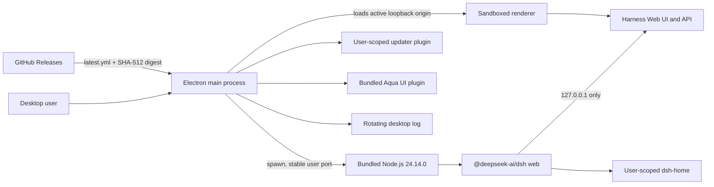

# Architecture

## Process model

The Electron main process owns the Harness child process. It launches `dsh --profile web --patch <desktop-updater-patch> --host 127.0.0.1 --port <stable-user-port>`, parses the address reported by the upstream CLI, verifies an HTTP response, and only then navigates the desktop window to that origin. The per-user port remains stable so origin-scoped Web UI settings and wallpaper data survive restarts. If that port is temporarily occupied, the current launch falls back to another loopback port without replacing the saved preference. App shutdown terminates the child process tree.

## Runtime layout

The build keeps desktop and Harness dependencies separate:

- The root package contains Electron and electron-builder as development dependencies.
- `runtime/package.json` pins production dependencies used by Harness.
- `scripts/prepare-runtime.ps1` uses `pnpm deploy --prod` to produce a self-contained `build/runtime` tree.
- electron-builder stores that production tree under `resources/harness`, with the pinned `node.exe` under `resources/runtime`.

Separating the runtime prevents Electron build tooling from being shipped to users and keeps native Harness modules outside `app.asar`, so they are loaded by the matching standalone Node.js runtime instead of Electron's Node ABI.

## Data and upgrades

Program files are read-only at runtime. Harness data is placed under Electron's user-data directory in `dsh-home`; updater preferences, the stable Harness port, and window placement live in `desktop-settings.json`; diagnostics go to `logs/desktop.log`. Window geometry is restored only when it remains visible on a connected display. On the first v0.0.2 launch, the legacy `DeepSeek Harness Desktop` directory is moved to `DeepSeek Harness` when safe. The installer does not delete application data during uninstall.

The desktop updater itself is an Electron main-process service backed by `electron-updater`. A narrow preload bridge exposes only update state, the enabled preference, and a manual check command. A bundled Harness plugin renders these controls in General Settings. Checks start ten seconds after launch and repeat every six hours when enabled; downloaded updates can install immediately or on exit.

The Aqua transparent UI package is pinned in the production runtime. On startup, the desktop main process copies its runtime files into the Web profile and registers the local package with `dsh plugin --offline`, so first use and version upgrades never depend on npm or GitHub availability.

## Security choices

- Loopback-only binding keeps the service private, while a validated per-user port preserves origin-scoped UI state across launches.
- The renderer uses `contextIsolation: true`, `nodeIntegration: false`, `sandbox: true`, and `webSecurity: true`.
- Browser permission requests and webviews are denied.
- Navigation is limited to `file:` startup pages and the exact current Harness origin.
- External links accept only HTTP(S) and open in the operating system browser.
- API keys and session data are never copied into the source tree or release artifacts.
- Update checks are pinned to `Icdafy/DeepSeek-Harness-Desktop`; arbitrary update URLs are not exposed to the renderer.

## Release integrity

Each tag build runs tests, performs a packaged portable-app smoke test, and publishes SHA-256 hashes plus electron-updater metadata and an NSIS blockmap. GitHub also attaches source archives generated from the release tag. Current releases are unsigned; future production releases should add Authenticode signing without weakening checksum publication.
